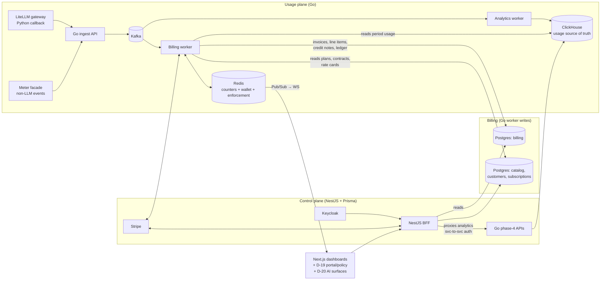

# ADR-001: Unified Billing Architecture for QuantumBilling

**Status:** v1.2 — Accepted / reconciled with BUILD_PLAN, DISPATCH, and ERD
**Date:** 2026-07-02
**Scope:** Reconciles the `backend/` (Go event engine) and `uiflow/` (NestJS control plane) specifications into one architecture; defines the hybrid subscription + usage billing model; elevates market-parity capabilities to core requirements.

---

## 1. Context: the split-brain problem

The `backend/` and `uiflow/` story sets describe **two complete, independent, contradictory usage pipelines**. Each side believes it owns ingestion, storage, aggregation, and invoicing; neither references the other.

### 1.1 What the backend docs specify

- Ingestion: LiteLLM callback → Go ingest API → Kafka (`usage-events`, 32 partitions, keyed by `org_id`) → Go analytics worker → ClickHouse `events.usage_events` (`ReplacingMergeTree(ingested_at)`, `ORDER BY (org_id, tenant_id, event_id)`), with the `argMax` dedup view `events.usage_events_dedup_v` (`story_6:37-48`, `story_9:37-62`).
- All 18 analytics endpoints (phase 4, stories 15–19) read **exclusively** from the ClickHouse dedup view; none touches Postgres or Redis (`phase_4:38`).
- Invoicing authority is explicit: *"Redis counters are NOT the source of truth for billing... ClickHouse is the auditable source of truth for invoice generation"* (`phase_2:275`). The Go billing worker keeps Redis counters for sub-5ms enforcement and reconciles them nightly against ClickHouse.
- Zero references to the uiflow layer, a "UI database," or any Postgres usage sync.

### 1.2 What the uiflow docs specify

- Its own ingest endpoint `POST /api/v1/meters/:meterId/events` writing directly to Postgres `billing.usage_events` via Prisma, with idempotency checked by querying that table (`quantumbilling_meter_user_story.md:187-193, 311-312`).
- Every dashboard (org overview, team usage, platform analytics, end-user dashboard) does live `SUM`/`GROUP BY` SQL over the raw Postgres table.
- Its own invoice generator: a daily cron computing `SUM(value) × rate` over Postgres (`quantumbilling_invoice_user_story.md:502-503`).
- Zero references to ClickHouse, Kafka, or the Go engine — including in `workflow_connectivity_analysis.md`, whose purpose is to verify connectivity.
- The table schema itself is internally inconsistent across stories (generic `value` column vs. LLM token columns; bare vs. `billing.`-qualified name).

### 1.3 Consequences if built as written

1. **Two invoice generators** producing disagreeing invoices from different stores with different math.
2. **Split-brain ingestion**: LiteLLM traffic lands in ClickHouse; meter-endpoint traffic lands in Postgres; each dashboard sees half the truth.
3. **Scale mismatch**: the uiflow model (row-per-event Postgres inserts with per-insert idempotency SELECTs, live GROUP BY over raw events) cannot approach the backend's 500k events/sec target (`phase_1:77`).

---

## 2. Decision 1 — Single usage pipeline; uiflow becomes control plane + BFF

**The Go/Kafka/ClickHouse event engine is the sole ingestion path and the sole source of truth for usage. The NestJS/Prisma layer stores no raw usage events.**

| Concern | Owner | Store |
|---|---|---|
| Event ingestion (all sources) | Go ingest API → Kafka | ClickHouse (via analytics worker) |
| Usage analytics (dashboards) | Go phase-4 APIs | ClickHouse `usage_events_dedup_v` |
| Real-time enforcement (<5ms) | Go + Redis counters | Redis |
| Catalog, customers, contracts, plans, subscriptions, entitlement config, dunning config, payment methods, identity | NestJS + Prisma | Postgres (control plane) |
| Invoices, line items, credit ledger, payments, credit notes | Go billing worker (writer); NestJS (reader/presenter) | Postgres (billing) |

Concretely:

1. **Delete `billing.usage_events` from the Prisma schema.** No raw usage rows in the control plane.
2. **Dashboards read usage by proxying the Go phase-4 analytics APIs.** NestJS acts as BFF: it validates the Keycloak JWT, derives `org_id`/`customer_id`/`end_user_id` scope, and forwards to the Go APIs. This also closes the backend's open question of a phase-4 auth mechanism (`phase_4:27-31` defines RBAC roles but no token scheme): **phase-4 APIs accept service-to-service auth from the NestJS BFF, which carries the resolved customer/end-user scope.**
3. **The uiflow meter-events endpoint becomes a facade** that translates generic `{value, timestamp, idempotency_key}` meter events into the engine's event shape and forwards to the Go ingest API. Idempotency happens once, in Redis (`SETNX`, 24h TTL) — never via table scans. Non-LLM metering is preserved; the pipeline is singular.
4. **Exactly one invoice generator: the Go billing worker.** The uiflow invoice-generation cron (`quantumbilling_invoice_user_story.md:368, 502`) is struck. The uiflow invoice stories become read/present/pay flows over the billing tables the worker writes.
5. **`customer.usage_summary` (defined in `quantumbilling_usage_limits_user_story.md:152`) is retained as a materialized rollup**, populated by a scheduled job aggregating from ClickHouse — for limits UI and portal displays only. Real-time *enforcement* stays on Redis counters per `phase_2`.

### One-writer rule

Every table has exactly one writing service. NestJS writes control-plane config; the Go billing worker writes financial artifacts. Anything else is a read.

### 2.1 Unified entity vocabulary (tenant → customer)

The backend docs use *Organization → Tenant → User*; the uiflow docs use *Organization → Customer → End User*. These are the same hierarchy, but the mapping is stated nowhere — and the backend also duplicates its own `organizations`/`tenants`/`users` tables (`story_6:25-31`) alongside the uiflow `identity`/`customer` schemas.

**Decision:** since nothing is built yet, eliminate the bridge rather than maintain it. The uiflow vocabulary is canonical everywhere:

- Backend `tenant_id` → `customer_id` (= `customer.customers.id`); backend `user_id` → `end_user_id` (= `customer.end_users.id`). All IDs are UUIDs issued by the control plane.
- The event engine's duplicate `organizations`/`tenants`/`users` tables are **dropped**. The engine validates against the canonical tables via its existing Redis existence caches (`org:{org_id}`, `org:{org_id}:enduser:{end_user_id}`), write-through-populated from control-plane Postgres.
- The event schema (Go structs, Kafka payload, ClickHouse columns, LiteLLM callback metadata, `KeyContext`) uses `customer_id`/`end_user_id`. Any backend story code sample using `tenant_id`/`user_id` is to be read with the renamed fields; ClickHouse `ORDER BY` becomes `(org_id, customer_id, event_id)`.

---

## 3. Decision 2 — One invoice engine, two rating inputs (hybrid billing)

QuantumBilling bills a **monthly (subscription) component and a usage component on one invoice**, per the billing overview (usage charges + plan base fee + overage − credits + tax). There is no separate "monthly biller": the Go billing worker composes line items from two authoritative sources.

| Line item | Computed from | Source of truth |
|---|---|---|
| Plan base fee (monthly/quarterly/yearly) | Subscription + plan price, prorated | Postgres control plane |
| Usage charges | Per-meter aggregation for the period × rate card | ClickHouse × Postgres rates |
| Overage | `max(0, usage − included units)` × overage rate | ClickHouse actuals, Postgres allowances |
| Commit true-up | Final term invoice only: `max(0, commit_amount − Σ term eligible spend)`, where eligible spend is `USAGE + OVERAGE` lines | Postgres contract, ClickHouse actuals, rated line-item spend |
| Credits (FEFO by priority), tax | Ledger, tax config | Postgres |

### 3.1 Billing period rules

1. **The subscription anniversary defines the period window** — not the calendar month. Usage aggregation against ClickHouse uses exactly that per-subscription window.
2. **Redis enforcement counters reset per-customer on their anniversary** (phase 2's "reset on billing boundaries"), driven off the subscriptions table — not globally on the 1st.
3. **Period membership is decided by `timestamp_ms`** (when the call happened), not `ingested_at`. Late arrivals are handled by re-rating (§4.1), not by holding invoices open indefinitely.
4. **Draft → finalize with a grace window**: the `draft` invoice opens at `period_end`; late in-period arrivals update it during `[period_end, period_end + INVOICE_GRACE_HOURS)`. At grace expiry the worker finalizes it to `pending`. Post-finalization events become prior-period adjustment lines on the next invoice or credit notes — issued invoices are never mutated.

### 3.2 Proration

Mid-cycle plan changes prorate **both** the base fee and the included-unit allowance. A plan-change history table in Postgres lets the worker rate each sub-window of the period against the plan active during it. Cancellation policy (immediate vs. end-of-period, refund treatment) is configured per plan.

### 3.3 Rate resolution (resolving the pricing-model vs rate-card fork)

The original ERD carries both `catalog.pricing_models` and `catalog.rate_cards` as "alternative pricing structures — confirm which path is primary" (`quantumbilling_pricing_user_story.md:364`). **Decision: both stay, with distinct roles and a deterministic precedence — there is no single "primary."**

- **Packaged path (product-led):** `plans → charges → pricing_models` — base fees, included units, self-serve overage shapes.
- **Negotiated path (sales-led):** `contracts → rate_cards (versioned) → contract_rates` — enterprise rates that override the package.

At rating time the billing worker resolves the unit rate per `(customer, meter, model, token_type)` through a strict waterfall, stopping at the first match:

1. `billing.contract_rates` (contract-specific override)
2. The contract's pinned `rate_card_version` entry
3. The subscription plan's charge → pricing model
4. **Unrated** → the event is flagged on a rating-exceptions report; never silently dropped and never billed at an implicit zero.

The resolved rate source is recorded per line item (feeds CR-1 reproducibility and CR-9 simulation).

### 3.4 Invoice-engine invariant

> **An invoice is a pure function of (immutable events, versioned rates/plans, period window).**

Given the same inputs, the worker must reproduce the same invoice byte-for-byte. This is what makes re-rating (§4.1), simulation (§4.9), and audit possible. No invoice math may depend on mutable state (Redis counters, current plan pointers, current rate cards).

---

## 4. Decision 3 — Market-parity capabilities as core requirements

Benchmarked against the 2026 standard bearers (Metronome/Stripe, Orb, Lago). The spec is at or above parity on ingestion throughput, enforcement latency, credit priority/FEFO, versioned rate cards, and commit contracts. The following are **core requirements**, not roadmap items. CR-1 and CR-2 bend the architecture and must be designed in from the start; the rest extend it.

### CR-1: Re-rating and backfill

Recompute any historical period when rates are renegotiated retroactively, events arrive late or are corrected, or a pricing bug is found. Mechanics:
- Events in ClickHouse are immutable; corrections are new events (`ReplacingMergeTree` + `event_id` dedup already supports superseding writes).
- Re-rate = re-run the invoice function (§3.4) over the period with corrected inputs, diff against the issued invoice, and emit a **credit note or debit adjustment** — never mutate the issued invoice.
- Every issued invoice stores the input snapshot references (rate card version, plan version, period window, aggregation watermark) needed to reproduce it.

### CR-2: Real-time prepaid wallet with burndown and auto top-up

The dominant AI monetization pattern (OpenAI-style), distinct from the spec's invoice-time credit offsets:
- Wallet balance decremented in real time on the existing Redis hot path as usage lands; balance pushed over the existing `updates:{org_id}` Pub/Sub → WebSocket channel.
- Entitlement check consults wallet balance: zero balance → block (configurable grace).
- **Auto top-up**: per-customer threshold + amount; crossing the threshold triggers a Stripe PaymentIntent on the saved method and a top-up receipt. Failures feed dunning.
- Wallet transactions append to the Postgres credit ledger (system of record); Redis is the enforcement cache, reconciled nightly like the spend counters.
- Prepaid wallet and postpaid invoicing coexist per customer (wallet-first, overflow to invoice, per contract terms).

### CR-3: Expanded pricing model coverage

Beyond `FLAT / PER_UNIT / TIERED`:
- **Graduated vs. volume tiers** as explicit, distinct semantics (the current `TIERED` is ambiguous).
- **Package/block pricing** (per 1K tokens, round up).
- **Matrix (dimension-based) pricing**: rate keyed by dimensions such as `model × token_type (input/output/cached/thinking)` as a first-class rate-card construct — not meter explosion per model.
- **Cost-plus/markup pricing**: `price = provider cost × (1 + margin)`, using the per-event `cost` field; the natural model for BYOK gateway traffic.
- **Per-seat pricing** with seat-change proration, composable with usage components on one plan.
- Per-period **minimums and maximums** on any usage component.

### CR-4: Credit notes, voids, and adjustments

A full credit-note object with its own state machine (draft → issued → applied/refunded), linked to the originating invoice and to re-rating runs. Void/reissue flows for draft-stage errors. This is the correction primitive CR-1 depends on.

### CR-5: Revenue recognition (ASC 606 / IFRS 15)

- Prepaid wallet purchases book as deferred revenue (contract liability); recognition occurs on consumption, derived from the credit ledger + ClickHouse usage.
- Commit contracts get true-up recognition treatment.
- Deliverable: a recognition ledger and period-close report, exportable to ERP (NetSuite/QuickBooks) — integration-ready, provider-pluggable.

### CR-6: Payment auto-collection

Replace "record a payment" as the primary flow: on invoice finalization, auto-charge the default Stripe payment method; smart retry schedule integrated with the dunning state machine; ACH/SEPA support for enterprise invoices; manual recording remains for wires/checks.

### CR-7: Tax automation integration point

The internal `tax_rates` table is a fallback, not the strategy. Define a pluggable tax provider interface (Avalara/Anrok/Stripe Tax) invoked at invoice finalization; support customer tax IDs, VAT reverse-charge annotation, and jurisdiction resolution from billing address.

### CR-8: Billing groups / consolidated invoicing

Optional roll-up: one invoice per customer (across subscriptions) or per parent org (across child customers), using the existing Organization → Customer hierarchy. The invoice generator takes a grouping level; line items retain their subscription attribution.

### CR-9: Pricing simulation / backtesting

Replay a draft rate card or plan against historical ClickHouse usage for a cohort (org, segment, or all customers) and report revenue delta per customer before activation. Reuses the §3.4 invoice function with a substituted rate input — a ClickHouse query away; highest leverage-to-effort item on this list.

### CR-10: Outcome- and agent-action pricing

Support billing units beyond tokens: agent actions, tasks, resolutions. The generic meter design (`event_type` + aggregation) already represents these; add first-class stories for outcome event ingestion (with success criteria fields in `metadata`), outcome meters, and their rate-card entries.

### CR-11: Margin / COGS analytics

Separate **provider cost** (COGS, from the event `cost` field / LiteLLM spend) from **customer price** (rated revenue) end-to-end. Deliver per-org, per-model, per-provider margin dashboards from ClickHouse. Internal-facing; the data already exists — the schema must keep the two amounts distinct.

### CR-12: Test clocks

A billing sandbox with frozen/advanceable time per test customer, so period-close, proration, grace windows, dunning schedules, and anniversary resets are testable deterministically. Required before the billing worker ships; the §3.4 purity invariant makes this tractable (time is an input, never sampled).

### CR-13: Warehouse-native export

Scheduled sync of usage aggregates, invoices, and the recognition ledger to customer-owned Snowflake/BigQuery (or S3 parquet), beyond the existing CSV/PDF reports.

### CR-14: Trials and recurring grants

Free-trial periods on subscriptions (no base fee, optional usage allowance) and **recurring credit grants** (monthly included credits that reset on the anniversary, non-rollover by default) as plan features, implemented on the CR-2 wallet.

---

## 5. Target topology

---

## 6. Impact on existing story docs

`backend/` additions:

| Doc | Change |
|---|---|
| `phase_2_billing_worker.md` | Add: reads subscriptions/plans for base-fee + included-unit lines; proration; anniversary-driven periods and counter resets; draft/grace/finalize flow; wallet decrement (CR-2); re-rating runs + credit notes (CR-1, CR-4); grouping levels (CR-8) |
| `phase_4_*` + stories 15–19 | Specify svc-to-svc auth from NestJS BFF (closes open auth question) |
| `story_1`, `story_6`, `story_9` (+ all code samples) | Vocabulary rename per §2.1: `tenant_id`→`customer_id`, `user_id`→`end_user_id` in structs, DDL, ClickHouse ORDER BY; drop duplicate `organizations`/`tenants`/`users` DDL from story_6 (Kafka partition key stays `org_id` — unaffected) |
| New stories | Wallet & auto top-up (CR-2), re-rating engine (CR-1), simulation (CR-9), rev-rec ledger (CR-5), test clocks (CR-12), margin analytics (CR-11) |

`uiflow/` rewrites (data-source sections must change from Postgres `billing.usage_events` to Go phase-4 API calls; the table is deleted):

| Doc | Change |
|---|---|
| `quantumbilling_meter_user_story.md` | Ingest endpoint becomes facade → Go ingest API; drop Postgres `usage_events` + transactional idempotency |
| `quantumbilling_organization_overview_user_story.md` | Read via phase-4 org summary/tenant APIs |
| `quantumbilling_team_usage_user_story.md` | Read via phase-4 user-usage APIs |
| `quantumbilling_platform_analytics_user_story.md` | Read via phase-4 analytics APIs (SUPER_ADMIN scope) |
| `quantumbilling_end_user_dashboard_user_story.md`, `quantumbilling_end_user_events_user_story.md` | Read via phase-4 user summary/activity APIs |
| `quantumbilling_invoice_user_story.md` | **Delete the invoice-generation cron**; story becomes present/pay/credit-note views over billing tables |
| `quantumbilling_reports_user_story.md` | Source aggregates from phase-4 APIs / warehouse export (CR-13) |
| `quantumbilling_usage_limits_user_story.md` | `customer.usage_summary` = ClickHouse-fed rollup for display; enforcement wording points to Redis path |
| `quantumbilling_credits_user_story.md`, `quantumbilling_payment_method_management_user_story.md` | Add wallet, burndown display, auto top-up config (CR-2); auto-collection (CR-6) |
| `quantumbilling_pricing_user_story.md`, `quantumbilling_rate_cards_user_story.md` | Add CR-3 models; simulation (CR-9) |
| `workflow_connectivity_analysis.md` | Rewrite around this topology; add the event engine it currently omits |
| D-19 UI tail stories | Portal and policy surfaces (developer portal, API-key UI, entitlement grants, rate-limit policy UI, tax config UI, customer portal) sit in the Next.js/BFF control plane and do not change usage ingestion or billing authority |
| D-20 AI surfaces | Chatbot and recommendations are UI/BFF surfaces over the reconciled analytics, billing, and customer data; they do not introduce a second usage pipeline |

---

## 7. Remaining open questions (out of scope here)

1. **Secrets management**: BYOK master key is a raw env var with an unsafe local fallback (`story_13`). Adopt KMS/Vault envelope encryption before production.
2. **Flink vs. custom Go aggregator** for 1/5-min windows: recommend the Go aggregator (no JVM cluster; windowed sums are simple at this scale). Decide before phase 1 build.
3. **SMS provider** (dunning) and **object storage** (reports): suggest Twilio and S3-compatible.
4. **Shared vs. split billing Postgres** between the Go worker and NestJS: default is one instance, schema-separated, one-writer rule enforced; revisit if operational isolation demands it.
