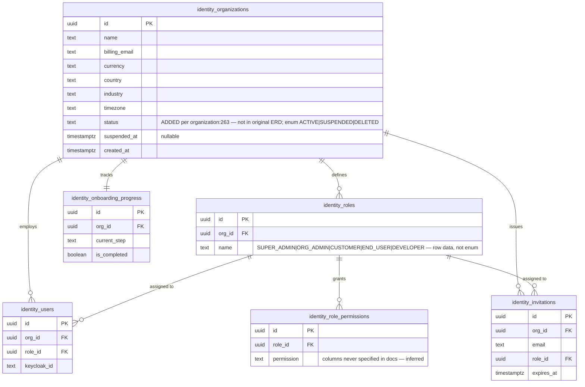
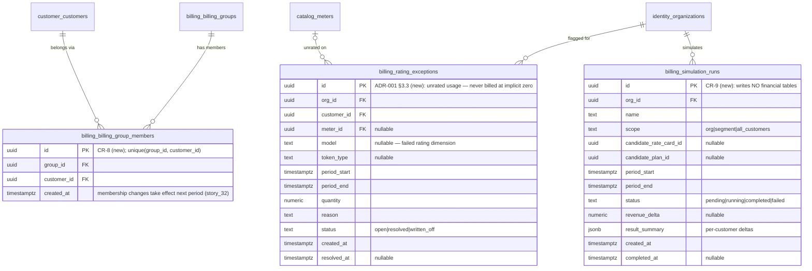
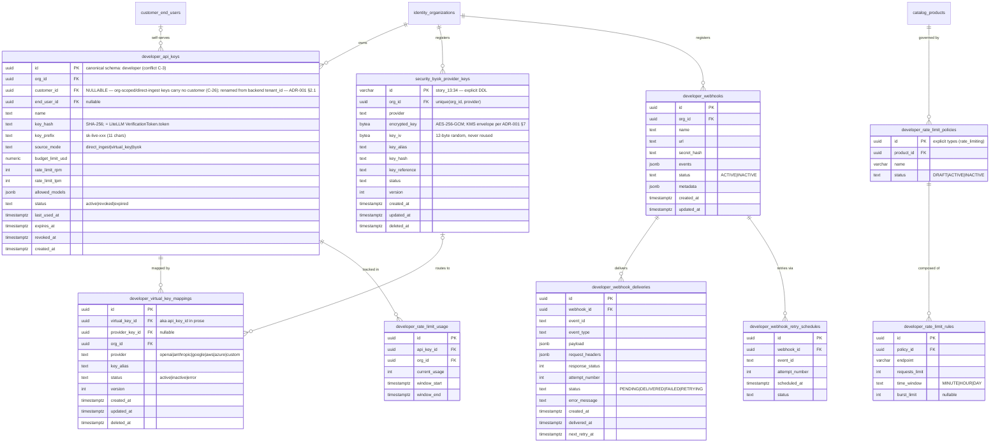
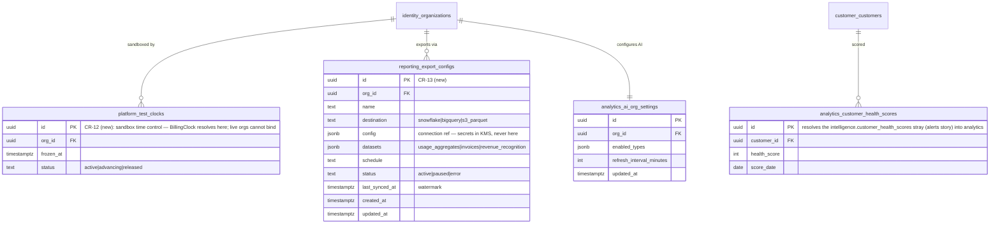
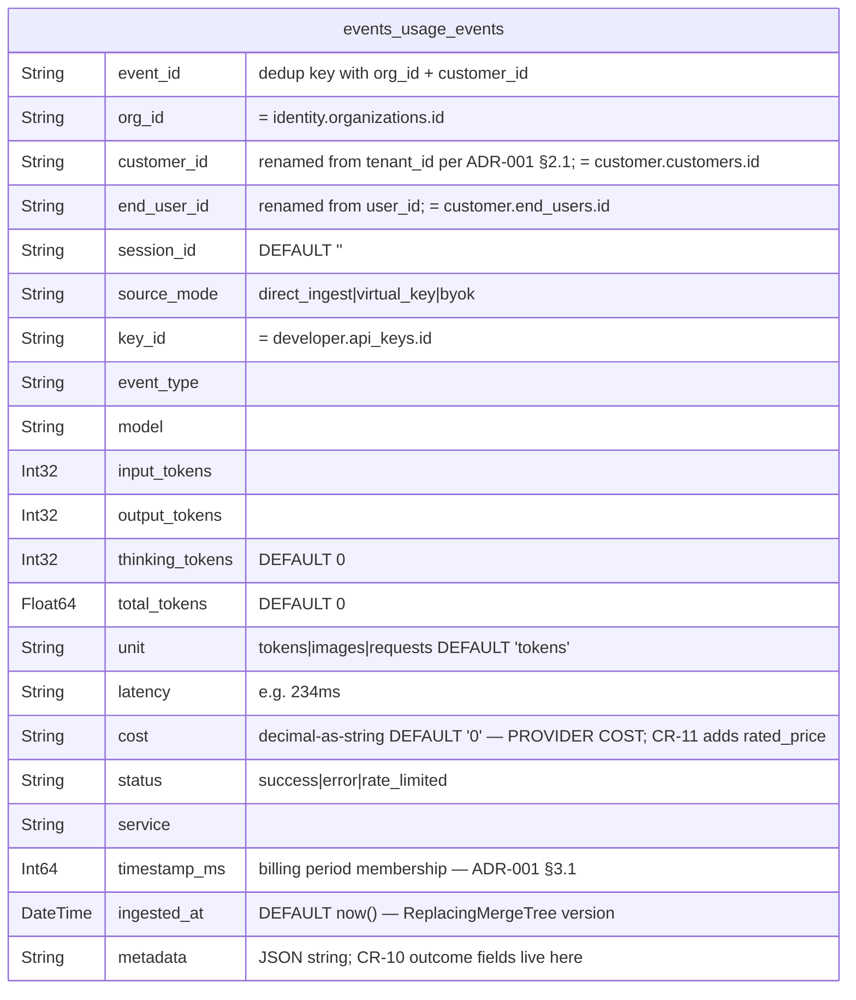
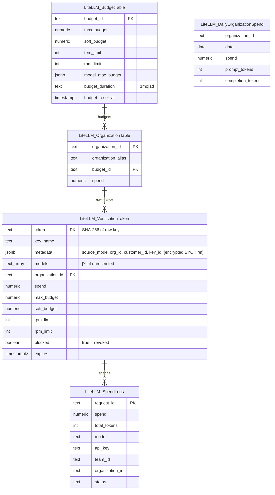

# QuantumBilling — Reconstructed ERD

**Status:** v1.2 — reconstructed 2026-07-01, reconciled with prisma/schema.prisma and DISPATCH v1.2 on 2026-07-02 · Companion to [ADR-001](ARCHITECTURE_DECISION.md)
**Provenance:** Seven uiflow stories cite an external "ERD" that was never committed to this repo (e.g. `meter:309`, `organization:180`, `pricing:364`). This document reconstructs it from every "Data Tables" section, Prisma snippet, and schema-alignment note across all ~70 story docs — then **normalizes it to the ADR-001 target architecture**.

**How to read this document:**
- Diagrams show the **canonical (resolved) model**. Where source docs conflict, the diagram shows the resolution and the [Conflict Register](#conflict-register) (§9) records every variant with citations.
- Tables added by ADR-001 core requirements are suffixed `⟨CR-n⟩` in comments.
- Types: only `story_6`, `story_13` (backend) and `rate_limiting` (uiflow) declare SQL types; everything else was inferred. **Authority split:** this ERD is the *conceptual canon* (entities, relationships, enums, conflict resolutions); [`prisma/schema.prisma`](prisma/schema.prisma) is the *executable DDL authority* (exact types, nullability, indexes, constraints). Where they differ, the difference must be resolved through the Conflict Register (§9) — never left standing.
- Mermaid cannot render dots in entity names: `identity_organizations` = `identity.organizations`.

**Store map (per ADR-001):**

| Store | Role | Writer |
|---|---|---|
| Postgres — `identity`, `customer`, `catalog`, `developer`, `security`, `communication`, `reporting`, `analytics`, `compliance`, `platform`, `workflow` | Control plane | NestJS/Prisma |
| Postgres — `billing` | Financial artifacts | Go billing worker |
| Postgres — `audit` | Security-violation log (`security_audit_logs`) | Go engine services (ingest, keys-api, gateway hooks) |
| ClickHouse — `events` | Usage source of truth | Go analytics worker |
| Redis | Enforcement cache, wallet cache, idempotency, pub/sub | Go services |
| LiteLLM Postgres (separate DB) | Gateway operational store | LiteLLM/Prisma |

> **Unified vocabulary (ADR-001 §2.1 — resolved):** the backend docs use *Organization → Tenant → User*; the uiflow docs use *Organization → Customer → End User*. Same hierarchy. Since nothing is built yet, the rename is applied everywhere rather than bridged: backend `tenant_id` → **`customer_id`**, backend `user_id` → **`end_user_id`**, all UUIDs issued by the control plane. The event engine's duplicate `organizations`/`tenants`/`users` tables (`story_6:25-31`) are **dropped** — it validates against the canonical tables via Redis existence caches. Backend story code samples using `tenant_id`/`user_id` are to be read with the renamed fields.

---

## 1. Identity & organization

## 2. Customer domain

```mermaid
erDiagram
    identity_organizations ||--o{ customer_customers : "serves"
    customer_customers ||--o{ customer_customer_contacts : "has"
    customer_customers ||--o{ customer_end_users : "has"
    customer_customers ||--o{ customer_contracts : "signs"
    customer_customers ||--o{ customer_subscriptions : "subscribes via"
    customer_customers ||--o{ customer_entitlement_grants : "granted"
    customer_customers ||--o{ customer_limit_overrides : "overridden by"
    customer_customers ||--o{ customer_usage_summary : "rolled up in"
    customer_contracts ||--o{ customer_subscriptions : "governs"
    customer_end_users ||--o{ customer_usage_summary : "rolled up in"

    customer_customers {
        uuid id PK
        uuid org_id FK
        text name
        text email
        text billing_email
        jsonb billing_address
        numeric credit_balance
        int health_score
        uuid tax_region_id FK
        text status "ACTIVE|SUSPENDED|CHURNED"
        timestamptz created_at
    }
    customer_customer_contacts {
        uuid id PK
        uuid customer_id FK
        text email
        text designation
        boolean is_primary
    }
    customer_end_users {
        uuid id PK
        uuid customer_id FK
        uuid org_id FK
        text external_user_id
        text name
        text email
        text status "active|suspended|canceled"
        jsonb metadata
        timestamptz created_at
    }
    customer_contracts {
        uuid id PK
        uuid customer_id FK
        uuid rate_card_id FK "nullable"
        text name
        numeric commit_amount
        boolean auto_renew
        text status "DRAFT|ACTIVE|EXPIRED|TERMINATED"
        date start_date
        date end_date
        timestamptz created_at
        timestamptz updated_at
    }
    customer_subscriptions {
        uuid id PK
        uuid org_id FK
        uuid customer_id FK
        uuid plan_id FK
        uuid contract_id FK "nullable"
        text status "scheduled|trialing|active|past_due|suspended|canceled|ended"
        text billing_period "MONTHLY|QUARTERLY|YEARLY"
        date start_date
        date end_date "nullable"
        timestamptz current_period_start "anniversary window — ADR-001 §3.1"
        timestamptz current_period_end
        boolean cancel_at_period_end
        timestamptz trial_end "nullable — CR-14"
        timestamptz created_at
    }
    customer_entitlement_grants {
        uuid id PK
        uuid customer_id FK
        uuid feature_id FK
        text scope "global|per_end_user"
        text reason
        text status "GRANTED|EXPIRED|REVOKED"
        timestamptz granted_at
        timestamptz expires_at "null = perpetual"
    }
    customer_usage_limits {
        uuid id PK
        uuid org_id FK
        uuid product_id FK
        uuid meter_id FK
        text limit_type "SOFT|HARD|WARNING"
        numeric limit_value
        text period "PER_MONTH|PER_YEAR|LIFETIME"
    }
    customer_limit_overrides {
        uuid id PK
        uuid customer_id FK
        uuid meter_id FK
        numeric original_limit
        numeric new_limit
        text status "ACTIVE|EXCEEDED|CANCELLED"
        timestamptz expires_at
        uuid created_by
    }
    customer_usage_summary {
        uuid id PK
        uuid customer_id FK
        uuid end_user_id FK
        uuid meter_id FK
        timestamptz period_start
        timestamptz period_end
        numeric total_usage
        numeric total_cost "ADR-001: materialized rollup FED FROM CLICKHOUSE — display only, not enforcement"
    }
    customer_entitlement_policy_versions {
        uuid id PK
        uuid entitlement_policy_id
        uuid org_id FK
        int version
        text change_type "GRANTED|REVOKED|UPDATED|EXPIRED"
        jsonb snapshot_data
        text change_summary
        uuid created_by
        timestamptz created_at
    }
```

`customer.usage_limits` also carries FK to `catalog.products`/`catalog.meters` (drawn in §3 to reduce clutter). `customer.customer_limits` from the customer story is **merged into** `customer.usage_limits` (Conflict C-10).

## 3. Catalog (products, plans, pricing, meters, rate cards)

```mermaid
erDiagram
    identity_organizations ||--o{ catalog_products : "sells"
    identity_organizations ||--o{ catalog_meters : "measures with"
    identity_organizations ||--o{ catalog_features : "offers"
    identity_organizations ||--o{ catalog_pricing_models : "prices with"
    identity_organizations ||--o{ catalog_rate_cards : "rates with"
    catalog_products ||--o{ catalog_product_features : "bundles"
    catalog_features ||--o{ catalog_product_features : "in"
    catalog_products ||--o{ catalog_plans : "offered as"
    catalog_plans ||--o{ catalog_plan_features : "includes"
    catalog_features ||--o{ catalog_plan_features : "in"
    catalog_plans ||--o{ catalog_charges : "charges via"
    catalog_meters ||--o{ catalog_charges : "measured by"
    catalog_pricing_models ||--o{ catalog_pricing_tiers : "tiered by"
    catalog_meters ||--o{ catalog_pricing_models : "prices"
    catalog_rate_cards ||--o{ catalog_rate_card_rates : "contains"
    catalog_meters ||--o{ catalog_rate_card_rates : "rated"
    catalog_rate_cards ||--o{ catalog_rate_card_versions : "versioned as"
    catalog_plans ||--o{ catalog_plan_versions : "versioned as"

    catalog_meters {
        uuid id PK
        uuid org_id FK
        text name
        text event_type "NOT meter_type (meter:309); supports outcome/agent-action events — CR-10"
        text aggregation "SUM|COUNT|AVG|GAUGE — NOT unit"
        text field
        text status "DRAFT|ACTIVE|INACTIVE"
        timestamptz last_event_at
        timestamptz created_at
        timestamptz updated_at
    }
    catalog_products {
        uuid id PK
        uuid org_id FK
        text product_code "SKU — NOT sku (product:339); unique(org_id, product_code)"
        text product_name "NOT name"
        text description
        text product_type "STANDALONE|ADD_ON|BUNDLE"
        text billing_model "SUBSCRIPTION|USAGE_BASED|ONE_TIME|HYBRID"
        text status "DRAFT|ACTIVE|INACTIVE|ARCHIVED"
        boolean is_public
        jsonb metadata
        timestamptz created_at
        timestamptz updated_at
    }
    catalog_features {
        uuid id PK
        uuid org_id FK
        text name
        text category
        text status
    }
    catalog_product_features {
        uuid id PK
        uuid product_id FK
        uuid feature_id FK
    }
    catalog_plans {
        uuid id PK
        uuid product_id FK
        text name
        text slug
        text billing_period "MONTHLY|QUARTERLY|YEARLY"
        int trial_days "CR-14"
        numeric base_amount "NOT base_price (conflict C-5)"
        text currency
        boolean pay_in_advance
        boolean is_active
        jsonb recurring_grant "CR-14: monthly included credits, reset on anniversary"
        int seat_included "CR-3: per-seat pricing"
        numeric seat_price
    }
    catalog_plan_features {
        uuid id PK
        uuid plan_id FK
        uuid feature_id FK
        numeric limit_value
    }
    catalog_plan_versions {
        uuid id PK "CR-1/ADR-001 §3.2 (new): plan-change history for proration and re-rating"
        uuid plan_id FK
        int version
        jsonb snapshot_data
        timestamptz effective_from
        timestamptz effective_to "nullable"
    }
    catalog_charges {
        uuid id PK
        uuid plan_id FK
        uuid meter_id FK
        text name
        text charge_type
        text charge_model "CR-3: FLAT|PER_UNIT|TIERED_GRADUATED|TIERED_VOLUME|PACKAGE|MATRIX|COST_PLUS"
        text billing_model
        numeric included_units "allowance before overage — ADR-001 §3"
        boolean pay_in_advance
        boolean is_active
    }
    catalog_pricing_models {
        uuid id PK
        uuid org_id FK
        uuid meter_id FK "nullable"
        text name
        text pricing_type "CR-3: FLAT|PER_UNIT|TIERED_GRADUATED|TIERED_VOLUME|PACKAGE|MATRIX|COST_PLUS"
        jsonb config "matrix dimensions (model x token_type), package size, markup pct"
        numeric minimum_amount "CR-3: per-period minimum"
        numeric maximum_amount "CR-3: per-period cap"
        date effective_from
        int version "optimistic lock (pricing notes)"
        text status "DRAFT|ACTIVE|ARCHIVED"
    }
    catalog_pricing_tiers {
        uuid id PK
        uuid pricing_model_id FK
        numeric from_qty
        numeric to_qty "null = unbounded"
        numeric price_per_unit
        int sort_order
    }
    catalog_rate_cards {
        uuid id PK
        uuid org_id FK
        text name
        date effective_date
        text status "DRAFT|ACTIVE|ARCHIVED"
    }
    catalog_rate_card_rates {
        uuid id PK
        uuid rate_card_id FK
        uuid meter_id FK
        text model_name "LLM model for matrix pricing"
        text token_type "CR-3: input|output|cached|thinking"
        numeric rate
        text unit_label
    }
    catalog_rate_card_versions {
        uuid id PK "canonical schema: catalog (conflict C-2)"
        uuid rate_card_id FK
        uuid org_id FK
        int version
        text change_type
        jsonb snapshot_data
        text change_summary
        timestamptz created_at
    }
```

> **Pricing fork — resolved (ADR-001 §3.3):** the original ERD carried `pricing_models` and `rate_cards` as alternative paths with the primary "to be confirmed" (`pricing:364`). Resolution: both stay, with distinct roles. **Packaged path** (product-led): `plans → charges → pricing_models`. **Negotiated path** (sales-led): `contracts → rate_cards → contract_rates`. Rating waterfall per `(customer, meter, model, token_type)`: contract rate → pinned rate-card version entry → plan charge's pricing model → **unrated** (flagged on a rating-exceptions report, never billed at implicit zero). The resolved source is recorded on each invoice line item.

## 4. Billing — invoices, payments, credits, wallet, dunning, tax

Written exclusively by the Go billing worker (financial artifacts) except configuration tables (`dunning_policies`, `tax_regions`, `currency_config`, `billing_groups`, wallet config), which NestJS writes.

```mermaid
erDiagram
    customer_customers ||--o{ billing_invoices : "billed"
    customer_subscriptions ||--o{ billing_invoices : "generates"
    billing_billing_groups |o--o{ billing_invoices : "consolidates"
    billing_invoices ||--o{ billing_invoice_line_items : "itemized by"
    billing_invoices ||--o{ billing_invoice_status_history : "audited by"
    billing_invoices ||--o{ billing_payments : "settled by"
    billing_payments ||--|| billing_payment_reconciliation : "reconciled by"
    billing_payment_methods ||--o{ billing_payments : "via"
    customer_customers ||--o{ billing_payment_methods : "stores"
    customer_customers ||--o{ billing_credits : "holds"
    billing_credits ||--o{ billing_credit_ledger : "moves via"
    billing_invoices ||--o{ billing_credit_ledger : "applied to"
    customer_customers ||--|| billing_wallets : "prepaid via"
    billing_wallets ||--o{ billing_wallet_transactions : "moves via"
    billing_invoices ||--o{ billing_credit_notes : "corrected by"
    billing_rerating_runs ||--o{ billing_credit_notes : "emits"
    billing_invoices ||--o{ billing_revenue_recognition_ledger : "recognized via"
    customer_contracts ||--o{ billing_contract_rates : "overrides rates"
    customer_contracts ||--o{ billing_discounts : "discounted by"
    billing_dunning_policies ||--o{ billing_dunning_steps : "sequenced by"
    billing_dunning_policies ||--o{ billing_dunning_communications : "sends"
    billing_invoices ||--o{ billing_dunning_communications : "chases"
    billing_tax_regions ||--o{ billing_tax_calculation_audit : "applied in"
    customer_customers ||--o{ billing_tax_exemptions : "exempt via"

    billing_invoices {
        uuid id PK
        uuid org_id FK
        uuid customer_id FK
        uuid subscription_id FK
        uuid group_id FK "nullable — CR-8 consolidated billing"
        text invoice_number "INV-YYYY-MM-NNN"
        text status "draft|pending|paid|overdue|voided (conflict C-4)"
        timestamptz period_start
        timestamptz period_end
        numeric subtotal
        numeric credits_applied
        numeric tax_rate
        numeric tax_amount
        numeric total "NOT amount"
        text currency
        date due_date
        timestamptz issued_at
        timestamptz paid_at
        uuid rate_card_version_id "CR-1: input snapshot for reproducibility"
        uuid plan_version_id "CR-1: input snapshot"
        timestamptz aggregation_watermark "CR-1: ClickHouse read watermark"
    }
    billing_invoice_line_items {
        uuid id PK
        uuid invoice_id FK
        uuid meter_id FK "nullable"
        text line_type "BASE_FEE|USAGE|OVERAGE|COMMIT_TRUE_UP|SEAT|ADJUSTMENT — ADR-001 §3"
        text description
        numeric quantity
        numeric unit_price
        numeric amount
        text model "LLM model attribution"
        uuid subscription_id "attribution under CR-8 grouping"
        text rate_source "ADR-001 §3.3 waterfall: contract_rate|rate_card_version|pricing_model"
        uuid rate_source_id "id of the resolved rate row — CR-1 reproducibility"
    }
    billing_invoice_status_history {
        uuid id PK
        uuid invoice_id FK
        uuid org_id FK
        text old_status
        text new_status
        uuid changed_by
        timestamptz changed_at
    }
    billing_credit_notes {
        uuid id PK "CR-1/CR-4 (new): correction primitive — issued invoices are never mutated"
        uuid org_id FK
        uuid customer_id FK
        uuid invoice_id FK
        uuid rerating_run_id FK "nullable"
        text note_number
        text kind "credit|debit"
        numeric amount
        text currency
        text reason
        text status "draft|issued|applied|refunded"
        timestamptz created_at
    }
    billing_rerating_runs {
        uuid id PK "CR-1 (new): re-rate a period, diff vs issued invoice"
        uuid org_id FK
        timestamptz period_start
        timestamptz period_end
        text scope "invoice|customer|org"
        text trigger "late_events|rate_change|correction"
        jsonb input_snapshot_refs
        numeric diff_total
        text status "pending|completed|failed"
        timestamptz created_at
    }
    billing_payments {
        uuid id PK
        uuid org_id FK
        uuid customer_id FK
        uuid invoice_id FK
        uuid payment_method_id FK
        numeric amount
        text currency
        text status "PENDING|COMPLETED|FAILED"
        text collection_mode "CR-6: auto_charge|manual|wire"
        text failure_reason
        text description
        timestamptz payment_date
        timestamptz created_at
        uuid created_by
        timestamptz deleted_at "immutable — corrections via credit note"
    }
    billing_payment_methods {
        uuid id PK
        uuid customer_id FK "customer-attached (conflict C-6)"
        text method_type "CARD|ACH|WIRE|BANK_TRANSFER|OTHER"
        text gateway_token "Stripe token — card data never stored"
        text brand
        text last4
        int exp_month
        int exp_year
        text bank_name
        text billing_name
        jsonb billing_address
        boolean is_default
        text status
        timestamptz created_at
        timestamptz updated_at
        timestamptz deleted_at
    }
    billing_payment_reconciliation {
        uuid id PK
        uuid org_id FK
        uuid payment_id FK
        text gateway_reference
        text status "PENDING|RECONCILED|DISPUTED"
        timestamptz reconciled_at
        uuid triggered_by
        timestamptz created_at
    }
    billing_credits {
        uuid id PK
        uuid org_id FK
        uuid customer_id FK
        text type "compensation(0)|promotional(1)|prepaid(2)|commit(3) — FEFO within priority"
        numeric original_amount
        numeric remaining_amount "NOT remaining_balance"
        numeric used_amount
        int priority
        text applicable_to
        text status "active|exhausted|expired|revoked"
        text notes
        timestamptz expires_at
        timestamptz created_at
    }
    billing_credit_ledger {
        uuid id PK
        uuid org_id FK
        uuid credit_id FK
        uuid invoice_id FK "nullable"
        text type "grant|usage|adjustment|expired|revoked|refunded"
        numeric amount
        numeric balance
        text description
        text event_id "usage event ref"
        timestamptz created_at
    }
    billing_wallets {
        uuid id PK "CR-2 (new): real-time prepaid burndown; Redis is the enforcement cache, this is the record"
        uuid org_id FK
        uuid customer_id FK
        numeric balance
        text currency
        numeric low_balance_threshold
        boolean auto_topup_enabled
        numeric topup_amount
        uuid topup_payment_method_id FK
        text status "active|frozen|closed"
        timestamptz updated_at
    }
    billing_wallet_transactions {
        uuid id PK "CR-2 (new)"
        uuid wallet_id FK
        text type "topup|auto_topup|burndown|refund|adjustment"
        numeric amount
        numeric balance_after
        uuid payment_id FK "nullable"
        text period_ref "burndown aggregation window"
        timestamptz created_at
    }
    billing_revenue_recognition_ledger {
        uuid id PK "CR-5 (new): ASC 606 — deferred vs recognized"
        uuid org_id FK
        uuid customer_id FK
        uuid source_id "invoice|credit|wallet_transaction"
        text source_type
        text entry_type "deferral|recognition|true_up"
        numeric amount
        date recognition_period
        timestamptz created_at
    }
    billing_billing_groups {
        uuid id PK "CR-8 (new): consolidated invoicing"
        uuid org_id FK
        text name
        text level "customer|organization"
        timestamptz created_at
    }
    billing_contract_rates {
        uuid id PK
        uuid contract_id FK
        uuid meter_id FK
        text model_name
        numeric rate
        text unit_label
        date effective_date
        date expires_date
    }
    billing_discounts {
        uuid id PK
        uuid org_id FK
        uuid contract_id FK
        text discount_type "PERCENTAGE|FIXED_CREDIT|VOLUME"
        numeric discount_value
        int priority
        date effective_date
        date expires_date
    }
    billing_dunning_policies {
        uuid id PK
        uuid org_id FK
        text name
        jsonb retry_schedule
        boolean is_default
        text status "DRAFT|ACTIVE|INACTIVE"
    }
    billing_dunning_steps {
        uuid id PK
        uuid policy_id FK
        int step_order
        text action "EMAIL|SMS|WEBHOOK|SUSPEND|ESCALATE (conflict C-11)"
        int day_offset
        text escalate_to
    }
    billing_dunning_communications {
        uuid id PK
        uuid dunning_policy_id FK
        uuid dunning_step_id FK
        uuid invoice_id FK
        uuid customer_id FK
        text channel
        text status "PENDING|SENT|FAILED|OPENED|CANCELLED"
    }
    billing_tax_regions {
        uuid id PK
        uuid org_id FK
        text country_code
        text state_code
        text name
        numeric rate
        text tax_type "SALES|VAT|GST|HST|UST|CUSTOM — internal fallback; CR-7 provider is primary"
        text status
    }
    billing_tax_exemptions {
        uuid id PK
        uuid customer_id FK
        uuid org_id FK
        text certificate_id
        text reason
        text status "active|expired|revoked|verified|rejected"
        timestamptz expires_at
    }
    billing_tax_calculation_audit {
        uuid id PK
        uuid invoice_id FK
        uuid org_id FK
        uuid customer_id FK
        uuid tax_region_id FK
        uuid exemption_id FK
        numeric taxable_amount
        numeric tax_rate
        numeric tax_amount
        text tax_type
        text tax_provider "CR-7: avalara|anrok|stripe_tax|internal"
        text provider_ref_id
        timestamptz calculated_at
    }
    billing_currency_config {
        uuid id PK
        uuid org_id FK
        text base_currency
        jsonb supported_currencies
        jsonb exchange_rates
        timestamptz last_updated
    }
```

Supplementary billing entities (full executable detail in `prisma/schema.prisma`):

> **Removed per ADR-001 §2: `billing.usage_events`.** It appeared in 9+ docs with 9 different column sets (Conflict C-1). Raw usage lives only in ClickHouse (§7); dashboards read the Go phase-4 APIs; `customer.usage_summary` (§2) is a ClickHouse-fed display rollup.

## 5. Developer & security (API keys, BYOK, rate limits, webhooks)

## 6. Platform ops — audit, compliance, alerts, reports, workflow, AI analytics

```mermaid
erDiagram
    identity_organizations ||--o{ platform_audit_logs : "audited"
    identity_organizations ||--o{ audit_security_audit_logs : "violations"
    identity_organizations ||--o{ compliance_gdpr_requests : "DSRs"
    identity_organizations ||--o{ compliance_compliance_reports : "frameworks"
    identity_organizations ||--o{ compliance_data_retention_policies : "retains per"
    identity_organizations ||--o{ compliance_discrepancies : "reconciles"
    identity_organizations ||--o{ developer_alerts : "alerts"
    developer_alerts ||--o{ developer_alert_channel_map : "routes"
    developer_alert_channels ||--o{ developer_alert_channel_map : "via"
    developer_alerts ||--o{ developer_alert_history : "fired"
    identity_organizations ||--o{ reporting_reports : "schedules"
    reporting_reports ||--o{ reporting_report_metrics : "measures"
    reporting_reports ||--o{ reporting_report_filters : "filtered"
    reporting_reports ||--o{ reporting_report_recipients : "sent to"
    reporting_reports ||--o{ reporting_report_runs : "executed"
    identity_organizations ||--o{ workflow_approval_workflows : "governs"
    workflow_approval_workflows ||--o{ workflow_approval_steps : "steps"
    workflow_approval_workflows ||--o{ workflow_approval_requests : "requests"
    identity_organizations ||--o{ analytics_ai_recommendations : "advised"
    analytics_ai_recommendations ||--o{ analytics_ai_recommendation_events : "acted on"
    customer_customers ||--o{ analytics_churn_risk_scores : "scored"
    identity_organizations ||--o{ analytics_revenue_insights : "summarized"
    identity_organizations ||--o{ communication_notification_templates : "templates"
    identity_organizations ||--o{ communication_notification_delivery_log : "delivery log"

    platform_audit_logs {
        uuid id PK "CANONICAL actor-action audit (conflict C-7) — absorbs bare audit_logs, shared.audit_logs, customer.audit_logs"
        uuid org_id FK
        uuid user_id FK
        text action
        text resource_type
        text resource_id
        jsonb old_value
        jsonb new_value
        inet ip_address
        text user_agent
        text status "SUCCESS|FAILURE"
        timestamptz created_at
    }
    audit_security_audit_logs {
        uuid id PK "security violations only; lives in the audit schema (C-7), written by Go engine services"
        uuid org_id FK "NULLABLE — invalid-key attempts may have no resolvable org (C-25): org_id NULL, key_prefix + reason in details"
        uuid api_key_id FK
        uuid customer_id FK
        text violation_type "invalid_key|budget_exhausted|rate_limit|guardrail_blocked"
        inet ip_address
        text details "max 1000 chars"
        text triggered_by
        timestamptz created_at
    }
    compliance_gdpr_requests {
        uuid id PK
        uuid org_id FK
        uuid customer_id FK
        text customer_email
        text request_type "EXPORT|DELETE|CONSENT_WITHDRAWAL"
        text status "PENDING|IN_PROGRESS|COMPLETED|PARTIAL|REJECTED"
        numeric data_size
        timestamptz requested_at
        timestamptz completed_at
    }
    compliance_compliance_reports {
        uuid id PK
        uuid org_id FK
        text framework "SOC2|ISO27001|GDPR|PCIDSS"
        text report_type
        text status "GENERATING|READY|FAILED"
        date last_audit_date
        date next_audit_date
        int findings_count
    }
    compliance_data_retention_policies {
        uuid id PK
        uuid org_id FK
        text data_type
        text retention_period
        boolean auto_delete
        timestamptz last_purge_at
    }
    compliance_discrepancies {
        uuid id PK
        uuid org_id FK
        uuid customer_id FK
        text disc_type
        text description
        numeric financial_impact
        text status "OPEN|INVESTIGATING|RESOLVED|WRITTEN_OFF"
        timestamptz detected_at
        text resolution
    }
    developer_alerts {
        uuid id PK
        uuid org_id FK
        text alert_type "USAGE|BILLING|CUSTOMER|CHURN|REVENUE"
        text name
        text condition_expr
        numeric threshold
        text status
        int trigger_count
        timestamptz last_triggered_at
    }
    developer_alert_channels {
        uuid id PK
        uuid org_id FK
        text channel_type "EMAIL|SLACK|WEBHOOK|PAGERDUTY|SMS"
        text name
        jsonb config
        text status "connected|available|error"
    }
    developer_alert_channel_map {
        uuid alert_id FK
        uuid channel_id FK
        uuid org_id FK
    }
    developer_alert_history {
        uuid id PK
        uuid alert_id FK
        uuid channel_id FK
        uuid customer_id FK
        text delivery_status "PENDING|SENT|DELIVERED|FAILED"
        numeric value_snapshot
        timestamptz triggered_at
    }
    reporting_reports {
        uuid id PK
        uuid org_id FK
        text name
        text type "revenue|usage|cohort|contracts|margin(CR-11)|rev_rec(CR-5)"
        text schedule
        text status "draft|active|paused|completed"
        timestamptz last_run_at
        timestamptz next_run_at
    }
    reporting_report_metrics {
        uuid id PK
        uuid report_id FK
        text metric_id
        text category
    }
    reporting_report_filters {
        uuid id PK
        uuid report_id FK
        text filter_type
        text filter_value
    }
    reporting_report_recipients {
        uuid id PK
        uuid report_id FK
        text email
    }
    reporting_report_runs {
        uuid id PK
        uuid report_id FK
        text status
        text output_url "S3/local, 90d retention; CR-13 adds warehouse sync"
        timestamptz executed_at
    }
    workflow_approval_workflows {
        uuid id PK
        uuid org_id FK
        text name
        text workflow_type
        text status "ACTIVE|INACTIVE"
        jsonb approvers
        jsonb conditions
    }
    workflow_approval_steps {
        uuid id PK
        uuid workflow_id FK
        int step_order
        text step_name
        uuid approver_id
        text approver_type
        text status "PENDING|APPROVED|REJECTED|SKIPPED"
        timestamptz completed_at
        text comments
    }
    workflow_approval_requests {
        uuid id PK
        uuid workflow_id FK
        uuid requester_id FK
        uuid org_id FK
        text resource_type
        text resource_id
        text status "PENDING|APPROVED|REJECTED|CANCELLED"
        uuid current_step_id FK
        timestamptz submitted_at
        timestamptz completed_at
    }
    analytics_ai_recommendations {
        uuid id PK "canonical schema: analytics (conflict C-8)"
        uuid org_id FK
        uuid customer_id FK
        text recommendation_type "CHURN_RISK|PAYMENT_FAILURE_RISK|PRICING_UPGRADE|TIER_OPTIMIZATION|REVENUE_ANOMALY|DUNNING_OPTIMIZATION|UPSELL_OPPORTUNITY|CREDIT_EXPIRY"
        text priority "HIGH|MEDIUM|LOW"
        text summary
        text detail
        text suggested_action
        jsonb potential_impact
        jsonb metadata
        text status "PENDING|ACTIONED|DISMISSED|EXPIRED"
        timestamptz created_at
        timestamptz expires_at
    }
    analytics_ai_recommendation_events {
        uuid id PK
        uuid recommendation_id FK
        uuid org_id FK
        uuid actor_id FK
        text event_type "VIEWED|ACTIONED|DISMISSED"
        text action_note
        timestamptz created_at
    }
    analytics_churn_risk_scores {
        uuid id PK
        uuid customer_id FK
        uuid org_id FK
        numeric score
        text risk_band "LOW|MEDIUM|HIGH|CRITICAL"
        jsonb contributing_factors
        timestamptz computed_at
    }
    analytics_revenue_insights {
        uuid id PK
        uuid org_id FK
        numeric current_mrr
        numeric prior_mrr
        numeric arr
        numeric nrr
        numeric grr
        numeric growth_rate_pct
        jsonb revenue_anomalies
        timestamptz computed_at
    }
    communication_notification_templates {
        uuid id PK
        uuid org_id FK
        text template_code
        text channel
        text subject
        text template_body
        text template_html
        boolean is_active
        boolean is_system
    }
    communication_notification_delivery_log {
        uuid id PK "canonical schema: communication (conflict C-9)"
        uuid org_id FK
        uuid customer_id FK
        text channel
        text recipient
        text status
        text error_code
        text error_message
        timestamptz sent_at
    }
```

Supplementary ops/analytics entities (full executable detail in `prisma/schema.prisma`):

## 7. ClickHouse — usage source of truth

Database `events`. Sole writer: Go analytics worker. All reads via the dedup view.

- Engine: `ReplacingMergeTree(ingested_at)` · `ORDER BY (org_id, customer_id, event_id)` · `PARTITION BY toYYYYMM(ingested_at)` (`story_6:38`, columns renamed per ADR-001 §2.1)
- View **`events.usage_events_dedup_v`**: `argMax(col, ingested_at)` grouped by `(org_id, customer_id, event_id)` — the only read surface (`story_9:117`)
- No FKs — links to Postgres are logical, by shared IDs.
- **CR-11 note:** `cost` records provider cost (COGS). Rated customer price is computed at invoice time; margin analytics compares the two. Consider an additional `rated_price` column or rating-time join.

## 8. LiteLLM gateway database (separate Postgres, Prisma-managed)

Logical links only: `VerificationToken.token` (SHA-256) = `developer.api_keys.key_hash`; `metadata` carries `{source_mode, org_id, customer_id, key_id}` (`story_20:112-114`; field renamed from `tenant_id` per ADR-001 §2.1 — the callback is our own code, so no external constraint). No spend write-back between stores — each tracks spend independently (`story_22:116`).

---

## 9. Conflict register

Every place the source docs contradict each other, with the resolution used above.

| # | Conflict | Variants (where) | Resolution |
|---|---|---|---|
| C-1 | `usage_events` in Postgres | 9+ column sets across meter, org-overview, team-usage, end-user-events/dashboard, platform-analytics, invoice, reports, credits; also aliased `usage.raw_events` & `metering.usage_snapshots` (ai_chatbot) | **Table deleted** (ADR-001 §2). ClickHouse `events.usage_events` is the only raw-event store |
| C-2 | `rate_card_versions` schema | `catalog` (contract) vs `billing` (rate_cards) | `catalog` — it versions a catalog entity |
| C-3 | `api_keys` schema | `developer` (developer_portal, ai_chatbot) vs `auth` (end_user_events/dashboard) | `developer`; backend `api_keys` DDL (story_6:29) merges in (key_hash, source_mode, budget/rate columns) |
| C-4 | Invoice status enum | `draft/pending/paid/overdue/voided` (invoice) vs `void` (tax) vs `ISSUED/PAID/PARTIAL/PAST_DUE/VOID/CREDITED` (payment) | Lowercase `draft/pending/paid/overdue/voided` per the state machine in the billing overview; partial payment = `pending` + payment rows; `CREDITED` replaced by credit notes (CR-4) |
| C-5 | `plans` columns | `base_amount`/`is_active` (pricing, product) vs `base_price`/`status` (subscription) | `base_amount`/`is_active` (pricing story is authoritative for its own entity) |
| C-6 | `payment_methods` attachment & naming | customer-attached (payment, customer_portal) vs org-attached (payment_method_management); `method_type/last4` vs `type/last_four` | Customer-attached (payer is the customer); `method_type`/`last4` |
| C-7 | Audit log fragmentation | `audit.security_audit_logs`, `platform.audit_logs`, `compliance.audit_logs`, `shared.audit_logs`, `customer.audit_logs`, bare `audit_logs`; `target_id` vs `resource_id` | Two tables: `platform.audit_logs` (actor actions, `resource_type/resource_id`) and `audit.security_audit_logs` (security violations). `compliance.*` keeps only GDPR/framework artifacts, not a third general log |
| C-8 | `ai_recommendations` schema | name prefix `analytics.` but schema column says `billing` (ai_recommendations); `billing.ai_recommendations` (ai_chatbot) | `analytics` (schema-column value is a copy-paste error) |
| C-9 | `notification_delivery_log` schema | `billing` (alerts narrative) vs `communication` (alerts data table) | `communication` |
| C-10 | Two limit tables | `customer.customer_limits` (customer) vs `customer.usage_limits` (entitlement, usage_limits) | Merged into `customer.usage_limits`; token-specific caps become meter-scoped rows |
| C-11 | Dunning step actions | Prisma `EMAIL_REMINDER/PHONE_REMINDER/SUSPEND_SERVICE/FINAL_NOTICE/COLLECTIONS/CUSTOM` vs retry-schedule JSON `EMAIL/SMS/WEBHOOK/SUSPEND/ESCALATE` (same doc) | `EMAIL/SMS/WEBHOOK/SUSPEND/ESCALATE` — matches the billing overview's dunning flow |
| C-12 | `subscriptions` design | `customer.subscriptions` (customer_id+contract_id+product_id, UPPERCASE statuses; 5 docs) vs `billing.subscriptions` (org_id+plan_id, mrr, lowercase statuses; 5 docs) | Merged as `customer.subscriptions` keyed by customer+plan (+nullable contract): lifecycle is control-plane. Lowercase status set (richer); `mrr` dropped (derived); `product_id` dropped (reachable via plan) |
| C-13 | Contract↔subscription FK direction | subscription→contract_id (contract) vs contract→subscription_id (subscription) | Subscription carries `contract_id` (a contract governs many subscriptions) |
| C-14 | `identity.organizations.status` | Absent from original ERD but SELECTed by meter/subscription; `ACTIVE/SUSPENDED/DELETED` (org) vs `trial/active/suspended/canceled` (onboarding) | Column added; `ACTIVE/SUSPENDED/DELETED` + `suspended_at`. Trial state lives on subscriptions (`trialing`), not orgs |
| C-15 | `meters.unit` | entitlement lists `unit` — the exact column meter:309 says is wrong | `event_type` + `aggregation` (meter story is authoritative) |
| C-16 | Customer status | `ACTIVE/SUSPENDED/CHURNED` (customer) vs `active/suspended/canceled` (customer_management) | `ACTIVE/SUSPENDED/CHURNED` per the Prisma enum and state machine |
| C-17 | Usage-limit enum mapping | API `SOFT/HARD/NONE` ↔ DB `soft/hard/warning`; override states `EXPIRED/REVOKED` (narrative) vs `EXCEEDED/CANCELLED` (enum) | DB enums win: `SOFT/HARD/WARNING`, `ACTIVE/EXCEEDED/CANCELLED`; API layer maps explicitly |
| C-18 | `credits` keying & naming | `org_id` (credits) vs `customer_id` (portal, ai_recs); `remaining_amount` vs `remaining_balance` | Both `org_id` and `customer_id` (customer-scoped, org-filterable); `remaining_amount` |
| C-19 | Invoice column names | `number` vs `invoice_number`; `total` vs `amount`; `credits` vs `credits_applied` | `invoice_number`, `total`, `credits_applied` (backend phase_2:210 set) |
| C-20 | Org naming style | `identity_organizations` written with underscore (tax, alerts) vs dot elsewhere | Dot (schema-qualified); underscore is a typo |
| C-21 | Backend vs uiflow entity duplication | Backend Postgres redefines meters/rate_cards/usage_limits/contracts/credits/invoices/dunning/tax (phase_2:199-215) with near-matching columns | Single set of canonical tables (this doc); Go worker and NestJS share one database, schema-separated, one-writer rule (ADR-001 §2) |
| C-22 | `mrr` location | On organizations (platform_analytics) vs subscriptions (subscription) | Neither — derived metric, computed in `analytics.revenue_insights` |
| C-23 | Entity vocabulary | Backend *Org → Tenant → User* + own `organizations`/`tenants`/`users` tables (story_6) vs uiflow *Org → Customer → End User* in `identity`/`customer` schemas | **Resolved (ADR-001 §2.1):** uiflow vocabulary canonical; `tenant_id`→`customer_id`, `user_id`→`end_user_id` everywhere incl. ClickHouse/Kafka/KeyContext; backend duplicate identity tables dropped |
| C-24 | Pricing path fork | `pricing_models` vs `rate_cards` as "alternative structures, primary TBD" (pricing:364 — unresolved in the original ERD itself) | **Resolved (ADR-001 §3.3):** packaged path (plans→charges→pricing_models) + negotiated path (contracts→rate_cards→contract_rates); rating waterfall contract_rate → rate_card_version → pricing_model → unrated-flagged |
| C-25 | Unknown-org security audit rows | story_14 said `org_id` defaults to literal `"unknown"` for invalid keys; the column is a UUID FK — un-insertable | **`org_id` is NULLABLE** (`NULL` = unresolvable org); `key_prefix` + reason go in `details`. Prisma + stories + dispatch updated |
| C-26 | `developer.api_keys.customer_id` nullability | Required in the first-cut Prisma vs optional in story_11 / OpenAPI (`ApiKeyCreateRequest` requires only `org_id` + `name`) and story_2's bare-org Redis fallback | **Nullable** — org-scoped/direct-ingest keys carry no customer |

## 10. Redis key appendix (not ERD entities)

| Key | Type | Value | TTL |
|---|---|---|---|
| `apikey:{key}` | String | JSON `KeyContext {key_id, org_id, customer_id, source_mode, status}` (renamed per ADR-001 §2.1) | none |
| `idem:{org_id}:{event_id}` | SETNX | idempotency marker | 24h |
| `org:{org_id}` / `org:{org_id}:enduser:{end_user_id}` | String | existence/membership flag, fed from canonical `identity`/`customer` tables | 1h |
| `bf:{org_id}:{shard}` | Bloom (Redis Stack) | batch dedup, 0.1% FPR, 10M/shard | persistent |
| `usage:{org_id}[:{customer_id}\|:{end_user_id}]` | Float | token counters, reset per-customer on anniversary (ADR-001 §3.1) | none |
| `spend:{org_id}[:{customer_id}]` | Float | spend counters | none |
| `wallet:{customer_id}` | Float | **CR-2 (new)**: wallet balance enforcement cache | none |
| `vk:{api_key_id}` | String | virtual-key mapping cache (uiflow developer_portal) | pub/sub invalidated |
| `updates:{org_id}` | Pub/Sub | balance/usage deltas → WebSocket | n/a |

## 11. Original-ERD claims not reconstructible

Referenced by the stories but absent from every doc: full column list for `identity.role_permissions`; `developer.webhook_payload_templates` columns; the `quantumbill-phase8.jsx` reference mockup. (The pricing-model vs rate-card fork, which the original ERD itself left "to be confirmed", is now decided — see C-24 and ADR-001 §3.3.) If the original ERD file surfaces, diff it against this document — but this version is the ADR-001-aligned target either way.
