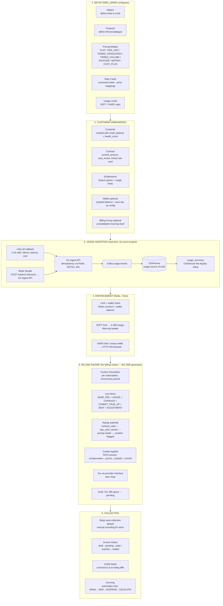

# QuantumBilling — Complete Billing Flow Overview

> Aligned with ADR-001 (2026-07-01).

A comprehensive end-to-end guide to how usage-based billing, invoicing, and collections work in QuantumBilling.

---

## Complete Billing Flow



---

### 1. Setup Phase

| Step | What happens | Who |
|------|-------------|-----|
| **Meters** | Define what to measure: `event_type`, `aggregation` (SUM/COUNT/AVG/GAUGE), `field`. State: `DRAFT → ACTIVE → INACTIVE` | ORG_ADMIN |
| **Products** | Create catalogue items (STANDALONE / ADD_ON / BUNDLE), each with a unique SKU. Must be linked to at least one Plan before publishing. State: `DRAFT → ACTIVE → INACTIVE → ARCHIVED` | ORG_ADMIN |
| **Pricing Models** | Define how to charge: `FLAT` (fixed fee), `PER_UNIT` (rate × quantity), `TIERED_GRADUATED` (each band at its own rate), `TIERED_VOLUME` (whole quantity at the reached band's rate), `PACKAGE` (per block, e.g. per 1K tokens, round up), `MATRIX` (rate keyed by dimensions such as model × token_type), `COST_PLUS` (provider cost × (1 + margin)). Per-period minimums/maximums supported. State: `DRAFT → ACTIVE → ARCHIVED` | ORG_ADMIN |
| **Rate Cards** | Versioned collections of `meter_id → rate` mappings (with model/token_type dimensions for matrix rates). Contracts reference a pinned rate card version; contract-specific rates override rate card rates. Supports cost preview. | ORG_ADMIN |
| **Usage Limits** | Per-customer, per-meter caps: `SOFT` (warn only) or `HARD` (block). Supports per-customer overrides. Period can be `PER_MONTH`, `PER_YEAR`, or `LIFETIME`. | ORG_ADMIN |

### 2. Customer Onboarding

| Step | What happens |
|------|-------------|
| **Customer** | Created with `credit_balance=0`, `health_score=100`, `status=ACTIVE`. State: `ACTIVE → SUSPENDED → CHURNED` |
| **Contract** | Links customer to a rate card. Defines `commit_amount` (minimum spend), `auto_renew` flag. State: `DRAFT → ACTIVE → EXPIRED / TERMINATED` |
| **Entitlements** | Feature grants (e.g., `api_access`, `advanced_analytics`) with optional `expires_at`. Checked by API gateway on every request. |
| **Wallet (optional, CR-2)** | Prepaid mode: a wallet with a real-time burndown balance, low-balance threshold, and auto top-up (amount + saved payment method). Composable with postpaid invoicing per customer — wallet-first, overflow to invoice, per contract terms. |
| **Billing Group (optional, CR-8)** | Consolidated invoicing roll-up: one invoice per customer (across subscriptions) or per parent org (across child customers). Line items retain their subscription attribution. |

### 3. Usage Ingestion (Real-Time)

All usage flows through the single Go event pipeline; the control plane stores no raw usage events.

1. **LLM traffic**: the LiteLLM gateway callback emits each call (tokens, latency, provider cost) to the **Go ingest API**
2. **Non-LLM metering**: `POST /api/v1/meters/:meterId/events` with `{value, timestamp, idempotency_key}` is a **facade** — the NestJS layer translates the meter event into the engine's event shape and forwards it to the Go ingest API
3. **Idempotency**: enforced once, in Redis (`SETNX`, 24h TTL) — duplicate events with the same key within 24h are deduplicated
4. **Pipeline**: Go ingest API → Kafka (`usage-events`) → analytics worker → **ClickHouse, the auditable source of truth for usage** (all reads via the dedup view)
5. **Auto-activation**: a meter transitions `DRAFT → ACTIVE` on its first event
6. **`usage_summary`** per `(customer, end_user, meter, billing_period)` is a scheduled rollup **fed from ClickHouse** — a display cache for limits UI and portals, never the truth and never used for enforcement or invoicing

### 4. Enforcement (Real-Time)

On every API request, the gateway checks Redis counters (and, for prepaid customers, the wallet balance) in <5ms. Counters reset per-customer on the subscription anniversary — not globally on the 1st. Nightly reconciliation against ClickHouse keeps counters honest; Redis is never the source of truth for billing.

| Condition | Result |
|-----------|--------|
| Usage < SOFT limit | Request proceeds normally |
| Usage ≥ SOFT limit | Request proceeds + `X-QB-Usage-Warning` header |
| Usage ≥ HARD limit | `HTTP 429 Too Many Requests` — blocked |
| Wallet balance = 0 (prepaid mode) | Blocked (configurable grace) |

**Override priority**: Customer-specific overrides > Plan-level limits.

### 5. Billing Engine (Periodic — Monthly/Quarterly/Yearly)

There is exactly **one invoice generator: the Go billing worker.** At each subscription's **anniversary** (the period window is per-subscription, not the calendar month), it generates one invoice per subscription (or per billing group under CR-8):

1. **Invoice generated** with number `INV-YYYY-MM-NNN`, status `draft`
2. **Line items composed** (types `BASE_FEE | USAGE | OVERAGE | COMMIT_TRUE_UP | SEAT | ADJUSTMENT`):
   - **Plan base fee**: from subscription + plan price, prorated for mid-cycle changes (Postgres control plane)
   - **Usage charges**: per-meter aggregation over the anniversary window read from ClickHouse (period membership by `timestamp_ms`), rated via the waterfall below
   - **Overage**: `max(0, usage − included units)` × overage rate
   - **Commit true-up**: `max(0, commit_amount − eligible spend over the contract term)`, where eligible spend is USAGE + OVERAGE only; emit `COMMIT_TRUE_UP` only on the final invoice of the contract term
   - **Seats**: per-seat pricing with seat-change proration
   - **Adjustments**: prior-period corrections and late-arrival deltas
3. **Rate resolution waterfall** per `(customer, meter, model, token_type)`, stopping at the first match: `contract_rates` → the contract's pinned `rate_card_version` entry → the plan charge's pricing model → **unrated** (flagged on a rating-exceptions report — never silently dropped, never billed at an implicit zero). The resolved rate source is recorded on each line item.
4. **Credits applied** automatically in priority order (FEFO — First Expiring, First Out):
   - Priority 0: Compensation credits (highest)
   - Priority 1: Promotional credits
   - Priority 2: Prepaid credits
   - Priority 3: Commit credits (lowest)
5. **Tax** calculated via the pluggable tax provider interface (Avalara/Anrok/Stripe Tax; internal `tax_rates` as fallback — CR-7), invoked at finalization
6. **Total** = subtotal − credits + tax
7. **Grace window**: the invoice stays `draft` for 24–48h after the anniversary, then finalizes to `pending`. Post-finalization events become adjustment lines on the next invoice or credit notes — issued invoices are never mutated.

> **Invariant:** an invoice is a pure function of (immutable events, versioned rates/plans, period window). Every issued invoice stores its input snapshot references (rate card version, plan version, period window, aggregation watermark) so it can be reproduced byte-for-byte.

#### Prepaid wallet mode (CR-2)

An alternative — and composable — mode alongside postpaid invoicing:

- Wallet balance is decremented **in real time** on the Redis hot path as usage lands; balance updates push over Pub/Sub → WebSocket to dashboards
- **Auto top-up**: crossing the per-customer threshold triggers a Stripe PaymentIntent on the saved method and a top-up receipt; failures feed dunning
- Wallet transactions append to the Postgres credit ledger (system of record); Redis is the enforcement cache, reconciled nightly
- Wallet-first, overflow to invoice — coexists with postpaid per contract terms

#### Credit notes & re-rating (CR-1 / CR-4)

Issued invoices are **immutable**. Corrections — retroactive rate changes, late or corrected events, pricing bugs — are handled by re-rating: re-run the invoice function over the period with corrected inputs, diff against the issued invoice, and emit a **credit note or debit adjustment** (credit notes have their own lifecycle: `draft → issued → applied/refunded`). Void/reissue covers draft-stage errors only.

### 6. Collection

| Step | Description |
|------|-------------|
| **Auto-collection (default, CR-6)** | On invoice finalization, the default Stripe payment method is charged automatically; smart retries integrate with dunning. ACH/SEPA supported for enterprise invoices. |
| **Manual recording** | ORG_ADMIN records wire/check payments via `POST /api/v1/payments`. Full payment → invoice `paid`. Partial → invoice stays `pending`. Payments are immutable; corrections via refund/credit note. |
| **Invoice States** | `draft → pending → paid` (normal) or `pending → overdue → voided` (collection failure) |
| **Reconciliation** | Each payment has a reconciliation record (`pending → reconciled / disputed`) |
| **Dunning** | Automated collection workflow when invoice is overdue: `EMAIL` (day 3) → `SMS` (day 7) → `SUSPEND` service (day 14) → `ESCALATE` (day 30). Fully configurable per org. If customer pays mid-dunning, all pending communications are cancelled. Auto top-up failures (prepaid mode) feed the same machine. |

---

## Invoice State Machine

```
┌─────────┐    finalize    ┌──────────┐    auto-pay /     ┌────┐
│  draft  │──────────────►│ pending  │◄─── manual pay ───▶│paid│
└─────────┘  (+24–48h      └────┬─────┘                   └────┘
              grace)             │                              ▲
                                │ dunning                      │
                                ▼                              │
                           ┌──────────┐                       │
                           │ overdue  │───────────────────────┘
                           └────┬─────┘    (credit/resolve)
                                │
                          void / write-off
                                │
                                ▼
                          ┌──────────┐
                          │ voided   │
                          └──────────┘
```

| State | Description |
|-------|-------------|
| `draft` | Invoice generated at anniversary; held for the 24–48h grace window for late events |
| `pending` | Invoice finalized and sent to customer, awaiting payment (auto-collection attempted) |
| `paid` | Payment received, invoice closed |
| `overdue` | Payment past due date, dunning process activated |
| `voided` | Invoice canceled/voided (no payment will be collected) |

Post-finalization corrections never move an invoice backwards — they produce credit notes or next-period adjustment lines.

---

## Credit Priority & Consumption (FEFO)

When an invoice is generated or usage is billed:

```
1. Calculate total amount owed
2. Fetch all active credits for the org (status = 'active')
3. Sort credits by:
   a. Priority (ascending — lower number first)
   b. Expiration date (ascending — sooner expiration first) [FEFO]
4. Apply credits in order until:
   - All credits exhausted, OR
   - Total amount owed is fully offset
5. Record credit ledger entries for each credit used
6. Update remaining balance on each credit
```

| Type | Description | Priority |
|------|-------------|----------|
| **compensation** | Credits for service issues or SLA violations | 0 (highest) |
| **promotional** | Free credits from campaigns or marketing | 1 |
| **prepaid** | Purchased credit packages | 2 |
| **commit** | Allocated from contract commitment | 3 |

These invoice-time credit offsets are distinct from the **prepaid wallet** (CR-2), which burns down in real time; wallet transactions land in the same Postgres credit ledger as the system of record.

---

## Relationship Model

```
Organization
  ├── Products (catalogue)
  ├── Meters (usage tracking)
  ├── Pricing Models (FLAT / PER_UNIT / TIERED_GRADUATED / TIERED_VOLUME /
  │                    PACKAGE / MATRIX / COST_PLUS)
  ├── Rate Cards (versioned meter→price mappings)
  ├── Dunning Policies
  ├── Billing Groups (optional consolidated invoicing — CR-8)
  │
  └── Customers
        ├── Contracts (linked to Rate Card; contract_rates override)
        ├── Subscriptions (plan, anniversary billing period)
        │     └── Invoice (per period, generated by the Go billing worker)
        │           ├── Line items (BASE_FEE / USAGE / OVERAGE /
        │           │               COMMIT_TRUE_UP / SEAT / ADJUSTMENT)
        │           ├── Credits applied (FEFO)
        │           └── Credit Notes (corrections — issued invoices immutable)
        ├── Wallet (prepaid balance + auto top-up — CR-2)
        ├── Entitlements (feature grants)
        ├── Usage Limits + Overrides
        ├── Payment Methods
        │
        └── End Users
              └── API Keys
```

Raw usage events are **not** a Postgres entity: every API call lands in **ClickHouse** (`events.usage_events`, keyed by `org_id`/`customer_id`/`end_user_id`) via the Go pipeline. Dashboards reach usage through the Go phase-4 analytics APIs; `usage_summary` in Postgres is a ClickHouse-fed display rollup only.

---

## Summary: End-to-End Timeline

```
Day 0:       ORG_ADMIN creates Products, Meters, Pricing Models, Rate Cards
Day 1:       Customer onboarded, Contract signed, Entitlements granted
             (optionally: Wallet funded, auto top-up configured)
Day 1-N:     End Users make API calls → LiteLLM callback / meter facade →
             Go ingest → Kafka → ClickHouse; wallet burns down in real time
Real-time:   Gateway checks Redis limits + wallet balance on every request
             (<5ms; SOFT warn / HARD block)
Anniversary: Go billing worker generates the draft invoice for the
             subscription's period window (base fee + usage + overage +
             true-up + seats, rated via the waterfall)
             → Credits auto-applied (priority + FEFO)
             → Tax via provider → draft held 24–48h → finalized to pending
             → Stripe auto-collection attempted
Due date:    Payment collected → invoice marked paid
             If unpaid → overdue → dunning workflow triggers
Later:       Late events / rate renegotiations → re-rating run →
             credit note or next-invoice adjustment (never mutate issued)
```

---

## RBAC Summary

| Role | Manage Products/Pricing | Manage Customers | View Invoices | Pay Invoices | Scope |
|------|------------------------|-----------------|---------------|-------------|-------|
| **SUPER_ADMIN** | Yes (any org) | Yes (any org) | Yes (all orgs) | N/A | Platform-wide |
| **ORG_ADMIN** | Yes (own org) | Yes (own org) | Yes (own org) | Yes (via portal) | Own org only |
| **CUSTOMER** | Read-only catalogue | No | Yes (own org) | Yes (pay own) | Own org only |
| **END_USER** | No | No | No | No | Own usage only |

---

## Key API Endpoints Quick Reference

| Domain | Key Endpoints |
|--------|--------------|
| **Meters** | `POST/GET/PATCH/DELETE /api/v1/meters`; `POST /api/v1/meters/:id/events` (facade → Go ingest API; Redis idempotency) |
| **Products** | `POST/GET/PATCH/DELETE /api/v1/products`, `GET /api/v1/products/catalogue` |
| **Pricing** | `POST/GET/PATCH /api/v1/pricing-models`, `GET /api/v1/pricing-models/:id/preview` |
| **Rate Cards** | `POST/GET/PATCH /api/v1/rate-cards`, `POST /api/v1/rate-cards/:id/preview` |
| **Contracts** | `POST/GET/PATCH/DELETE /api/v1/contracts`, `POST /api/v1/contracts/:id/renew` |
| **Entitlements** | `POST /api/v1/entitlements/grant`, `POST /api/v1/entitlements/revoke`, `GET /api/v1/entitlements/check` |
| **Usage Limits** | `POST/GET/PATCH/DELETE /api/v1/usage-limits`, `GET /api/v1/usage-limits/check` |
| **Usage & Analytics** | Go phase-4 APIs proxied by the NestJS BFF (Keycloak JWT validated, `org_id`/`customer_id` scope derived, svc-to-svc auth forwarded), e.g. `GET /v1/customers/:customerId/usage`, org summaries, end-user activity — all read ClickHouse |
| **Invoices** | `POST/GET /api/v1/invoices`, `GET /api/v1/invoices/:id/pdf` (read/present/pay over billing tables the Go worker writes) |
| **Payments** | `POST/GET /api/v1/payments`, `PATCH /api/v1/payments/:id/reconciliation` |
| **Credits** | `GET /api/v1/organizations/:orgId/credits`, `POST /api/v1/credits/grant` |
| **Wallet** | Wallet balance, transactions, and auto top-up config per customer (CR-2) |
| **Dunning** | `POST/GET/PATCH /api/v1/dunning-policies`, `POST /api/v1/invoices/:id/trigger-dunning` |
| **Customers** | `POST/GET/PATCH /api/v1/customers`, `POST /api/v1/customers/:id/credits` |
| **End Users** | `GET /my-usage`, `GET /my-events` (served via phase-4 user summary/activity APIs), `POST/GET/DELETE /api/v1/api-keys` |
