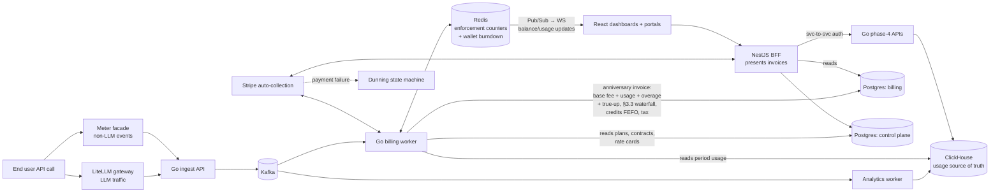

# QuantumBilling — Workflow Connectivity Analysis

> Aligned with ADR-001 (2026-07-01).

**Date:** 2026-07-01
**Purpose:** Verify that all user stories connect properly and data flows correctly between entities — across the full architecture: the Go/Kafka/ClickHouse usage plane, the Go billing worker, and the NestJS control plane/BFF (per ADR-001).

---

## Entity Hierarchy (Confirmed — canonical vocabulary per ADR-001 §2.1)

```
SUPER_ADMIN
    │
    └── Organization (e.g., "Acme AI Corp")
            │
            └── Customer (e.g., "Acme AI - Engineering")
                    │
                    └── End User (e.g., "John Smith")
                            │
                            └── API Keys
                            │
                            └── Usage Events ──► LiteLLM gateway / meter facade → Go ingest API
```

**Vocabulary note (ADR-001 §2.1):** the backend stories originally used *Organization → Tenant → User*. That is the same hierarchy; the rename is applied everywhere — backend `tenant_id` → `customer_id` (= `customer.customers.id`), backend `user_id` → `end_user_id` (= `customer.end_users.id`), including Go structs, Kafka payloads, ClickHouse columns (`ORDER BY (org_id, customer_id, event_id)`), LiteLLM callback metadata, and `KeyContext`. The event engine's duplicate `organizations`/`tenants`/`users` tables are dropped; it validates against the canonical control-plane tables via Redis existence caches.

| Entity | Belongs To | Store (per ADR-001 §2) | Examples |
|--------|------------|------------------------|----------|
| **Organization** | Platform | Postgres control plane (`identity`) | Acme AI Corp, DataFlow Systems |
| **Customer** | Organization | Postgres control plane (`customer`) | Engineering Dept, Marketing Dept |
| **End User** | Customer | Postgres control plane (`customer`) | John Smith, api-service@company.com |
| **Plan/Product** | Organization | Postgres control plane (`catalog`) | Starter, Pro, Enterprise |
| **Subscription** | Customer → Plan (+ optional Contract) | Postgres control plane | Anniversary defines the billing period (ADR §3.1) |
| **Invoice** | Subscription → Customer | Postgres `billing` — written by Go billing worker only | Base fee + usage + overage + true-up − credits + tax |
| **Credits / Wallet** | Customer | Postgres credit ledger (record) + Redis (enforcement cache, CR-2) | FEFO by priority at invoice time; real-time burndown |
| **Payment Methods** | Customer | Postgres `billing` (Stripe tokens only) | Visa, ACH |
| **Usage Events** | End User → Customer → Organization | **ClickHouse `events.usage_events` only** — never Postgres | LLM calls, metered events |

---

## End-to-End Data Flow (ADR-001 topology)

The path every billable event takes, from API call to paid invoice:

1. **End user API call** with API key (`Authorization: Bearer sk-live-...`).
2. **LiteLLM gateway** (LLM traffic; Python callback) — or the **meter facade** (`POST /api/v1/meters/:meterId/events`, non-LLM traffic), which translates generic `{value, timestamp, idempotency_key}` events into the engine's event shape — forwards to the **Go ingest API**. Idempotency once, in Redis (`SETNX`, 24h TTL); no table scans, no Postgres event rows.
3. **Go ingest API → Kafka** (`usage-events`, keyed by `org_id`).
4. **Analytics worker → ClickHouse** `events.usage_events` (`ReplacingMergeTree`, dedup via `usage_events_dedup_v`) — the **auditable source of truth for usage and invoicing**.
5. **Redis hot path** (billing worker): sub-5ms enforcement counters, entitlement checks, and **prepaid wallet burndown** (CR-2), reconciled nightly against ClickHouse; balance deltas pushed over `updates:{org_id}` Pub/Sub → WebSocket.
6. **Go billing worker** — the **only invoice generator** — at each subscription **anniversary** (draft + 24–48h grace, then finalize) composes the invoice: plan **base fee** (prorated) + **usage** + **overage** + **commit true-up**, rates resolved via the §3.3 waterfall (contract rate → pinned rate-card version → plan charge's pricing model → flagged unrated), **credits applied FEFO by priority**, then **tax** — and writes to **billing Postgres** (invoices, line items, credit ledger, credit notes).
7. **NestJS control plane presents** the invoice (read-only over billing tables); on finalization, **Stripe auto-collection** charges the default payment method (CR-6).
8. **Payment failure → dunning** state machine (retry schedule, notifications, suspend/escalate).
9. **Dashboards** (org overview, team usage, platform analytics, end-user views) read usage via the **NestJS BFF → Go phase-4 analytics APIs → ClickHouse dedup view** — never via Postgres usage tables (which no longer exist).



---

## RBAC Matrix (Confirmed)

| Role | Access Scope | Can Manage |
|------|--------------|------------|
| **SUPER_ADMIN** | Platform-wide | Everything |
| **ORG_ADMIN** | Own Organization | Org settings, customers, subscriptions, invoices, credits, payment methods |
| **CUSTOMER** | Own Customer Account | View invoices, pay, view credits (read-only), aggregate team usage |
| **END_USER** | Own End User | Own usage, own events, own API keys |

Auth: Keycloak JWT validated at the NestJS BFF, which derives `org_id`/`customer_id` scope and forwards to the Go phase-4 APIs with service-to-service auth (closes the backend's open phase-4 auth question — ADR §2 item 2).

---

## Story-Connectivity Mapping (which story owns each hop)

| Hop | Owner story/stories |
|-----|---------------------|
| End user API call / key validation | `backend/story_2` (Redis auth), `backend/phase_3` + `quantumbilling_api_key_management_user_story.md` |
| LiteLLM gateway + usage callback | `backend/phase_5`, `backend/story_21` |
| Meter facade (non-LLM events → Go ingest) | `quantumbilling_meter_user_story.md` (rewritten per ADR: facade, no Postgres `usage_events`, Redis idempotency) |
| Ingestion (ingest API → Kafka → ClickHouse) | `backend/phase_0` (stories 4–9) |
| Real-time enforcement + wallet hot path | `backend/phase_2` (Redis counters) + `quantumbilling_usage_limits_user_story.md` (display rollup `customer.usage_summary`, ClickHouse-fed) |
| Analytics reads (all dashboards) | `backend/phase_4` (stories 15–19) via BFF, consumed by `quantumbilling_organization_overview_user_story.md`, `quantumbilling_team_usage_user_story.md`, `quantumbilling_platform_analytics_user_story.md`, `quantumbilling_end_user_dashboard_user_story.md`, `quantumbilling_end_user_events_user_story.md` |
| Invoice generation (sole generator) | `backend/phase_2_billing_worker.md` — the uiflow invoice-generation cron is struck |
| Invoice present / pay | `quantumbilling_invoice_user_story.md` (read/present/credit-note views), `quantumbilling_payment_user_story.md`, `quantumbilling_customer_portal_user_story.md` |
| Payment methods / Stripe auto-collection (CR-6) | `quantumbilling_payment_method_management_user_story.md` |
| Credits + prepaid wallet (CR-2) | `quantumbilling_credits_user_story.md` (FEFO ledger; wallet burndown display + auto top-up config) |
| Dunning on payment failure | `quantumbilling_dunning_user_story.md` |
| Rates feeding the §3.3 waterfall | `quantumbilling_pricing_user_story.md`, `quantumbilling_rate_cards_user_story.md`, `quantumbilling_contract_user_story.md` |
| Subscriptions / anniversary periods | `quantumbilling_subscription_user_story.md` |
| Reports / export | `quantumbilling_reports_user_story.md` (phase-4 aggregates; CR-13 warehouse export) |

---

## Workflow 1: Platform Onboarding (Complete Flow)

```
1. SUPER_ADMIN creates Organization "Acme AI Corp"
   └── QB-STORY-029: Organization Onboarding
   └── webhook: organization.created

2. ORG_ADMIN sets up Payment Methods (Stripe-tokenized)
   └── QB-STORY-032: Payment Method Management

3. ORG_ADMIN creates Customers under Org
   └── QB-STORY-030: Customer Management
   └── Customer 1: "Engineering" · Customer 2: "Marketing"

4. Customer gets a Subscription (Plan, optional Contract)
   └── QB-STORY-022: Subscription Management
   └── Anniversary date fixes the billing period window (ADR §3.1)

5. ORG_ADMIN creates End Users under Customers
   └── QB-STORY-031: End User Management
   └── Control plane populates Redis existence caches for the event engine

6. End Users create API Keys
   └── QB-STORY-034: API Key Management
   └── Key provisioned to LiteLLM (backend/story_20); KeyContext cached in Redis

7. End Users make API calls → events flow LiteLLM/meter facade → Go ingest → Kafka → ClickHouse
   └── QB-STORY-027: End User Events (reads via phase-4)
   └── Redis counters + wallet burn in real time

8. Go billing worker aggregates the period from ClickHouse at anniversary
   └── backend/phase_2 — base fee + usage + overage + true-up, credits FEFO, tax
   └── Draft → grace window → finalized "pending" in billing Postgres

9. NestJS presents invoice; Stripe auto-collects (CR-6)
   └── QB-STORY-023: Invoice Management · QB-STORY-025: Credits Management

10. On payment failure → dunning
    └── quantumbilling_dunning_user_story.md
```

---

## Workflow 2: End User Makes API Call

```
1. End User "John" includes API Key in request
   Authorization: Bearer sk-live-7Kx9Ab2C...

2. LiteLLM gateway (or meter facade for non-LLM) authenticates via Redis KeyContext
   └── Resolves: end_user_id = "john_123"
                 customer_id = "cust_engineering"   (renamed from tenant_id — ADR §2.1)
                 org_id      = "org_acme"
   └── Entitlement check: limits + wallet balance (Redis, <5ms); zero wallet → block

3. Event emitted to Go ingest API → Kafka
   usage_event {
     event_id, org_id: "org_acme",
     customer_id: "cust_engineering",
     end_user_id: "john_123",
     model: "gpt-4", input_tokens: 1000, output_tokens: 500,
     cost: "0.03",              // provider COGS (CR-11)
     timestamp_ms: ...          // decides billing-period membership (ADR §3.1)
   }

4. Analytics worker writes to ClickHouse events.usage_events (dedup view = read surface)
   Billing worker increments Redis counters and burns wallet; delta pushed via Pub/Sub → WebSocket

5. Dashboards read through BFF → phase-4 APIs → ClickHouse:
   - End User "John"        → QB-STORY-028: End User Dashboard (story_16 APIs)
   - Customer "Engineering" → QB-STORY-024: Team Usage (story_16 APIs, aggregate)
   - Org "Acme AI Corp"     → QB-STORY-017: Organization Overview (story_15 APIs)
   - Platform               → QB-STORY-020: Platform Analytics (SUPER_ADMIN scope)

6. At the subscription anniversary the billing worker rates the period
   → invoice in billing Postgres → QB-STORY-023 presents it
```

---

## Workflow 3: Invoice Generation & Payment Flow

```
1. Billing worker fires at the subscription anniversary (not the calendar 1st)
   └── Reads period usage from ClickHouse dedup view (timestamp_ms window)
   └── Reads plan/contract/rate cards from control-plane Postgres

2. Line items composed (ADR §3):
   BASE_FEE        subscription plan price, prorated for mid-cycle changes
   USAGE           per-meter aggregation × rate (§3.3 waterfall:
                   contract_rate → pinned rate_card_version → pricing_model → UNRATED-flagged)
   OVERAGE         max(0, usage − included units) × overage rate
   COMMIT_TRUE_UP  max(0, commit_amount − eligible spend over the contract term); eligible spend is USAGE + OVERAGE only; emitted only on the final invoice of the contract term

3. Credits applied automatically — FEFO within priority
   └── QB-STORY-025: Credits Management
   └── Compensation → Promotional → Prepaid → Commit

4. Tax applied (pluggable provider, CR-7; internal tax_rates as fallback)
   └── Invoice written as draft; finalized to "pending" after 24–48h grace
   └── Issued invoices are never mutated — corrections via credit notes (CR-1/CR-4)

5. NestJS presents; Stripe auto-collection charges the default method (CR-6)
   └── QB-STORY-023: Invoice Management · QB-STORY-026: Customer Portal
   └── QB-STORY-032: Payment Method Management
   └── Manual pay (POST /api/v1/invoices/:invId/pay) remains for wires/checks

6. Success → status "paid".  Failure → dunning state machine
   └── quantumbilling_dunning_user_story.md — smart retries, notifications, suspend/escalate
   └── Wallet auto-top-up failures feed the same dunning path (CR-2)
```

---

## Workflow 4: Feature Grant Flow

```
1. ORG_ADMIN grants custom feature to Customer
   └── QB-STORY-033: Feature Grants
   └── Feature: "Batch API" (beta) → Customer: "Engineering"

2. Grant created in control-plane Postgres (status: GRANTED)
   └── Entitlement config synced to the Redis enforcement path

3. Customer sees the feature in entitlements
   └── QB-STORY-026: Customer Portal

4. End Users in "Engineering" pass the entitlement check on the hot path

5. Grant expires (cron: grant-expiration-checker) → GRANTED → EXPIRED
   └── Redis cache invalidated; enforcement blocks further use
```

---

## Workflow 5: Usage Viewing by Role (all reads via BFF → phase-4 → ClickHouse)

```
SUPER_ADMIN views all:
  └── QB-STORY-020: Platform Analytics (phase-4, SUPER_ADMIN scope)
  └── Any Organization → any Customer → any End User

ORG_ADMIN views org:
  └── QB-STORY-017: Organization Overview (story_15 org summaries)
  └── QB-STORY-024: Team Usage (all customers in org)
  └── QB-STORY-027: End User Events (all end users in org)

CUSTOMER views own:
  └── QB-STORY-026: Customer Portal
  └── QB-STORY-024: Team Usage (aggregate only — no per-user breakdown)

END_USER views own:
  └── QB-STORY-028: End User Dashboard (story_16 user summaries)
  └── QB-STORY-027: End User Events (own only)
  └── QB-STORY-034: API Key Management (own only)
```

---

## Key Points to Remember

1. **Customer ≠ Organization** — Customer is a sub-entity under Organization; **backend "Tenant" = Customer, backend "User" = End User** (ADR §2.1 rename).
2. **One usage pipeline** — every event, LLM or not, goes through the Go ingest API to ClickHouse. The meter endpoint is a facade, not a second pipeline; `billing.usage_events` in Postgres does not exist.
3. **One invoice generator** — the Go billing worker. NestJS only presents, collects payment, and manages config. One-writer rule on every table.
4. **ClickHouse is the source of truth for billing; Redis is the enforcement/wallet cache** — reconciled nightly, never invoiced from.
5. **Billing periods are per-subscription anniversaries**, membership decided by `timestamp_ms`; late events → re-rating + credit notes, never mutated invoices (ADR §3.1, §3.4, CR-1).
6. **Rates resolve deterministically** via the §3.3 waterfall; unrated usage is flagged, never silently zero-billed.
7. **Credits apply FEFO by priority at invoice time; the prepaid wallet burns in real time** (CR-2) — the two coexist per customer.
8. **Dashboards never query usage from Postgres** — always BFF → phase-4 APIs → ClickHouse dedup view.
9. **API Key identifies End User** — auth and usage attribution via Redis `KeyContext {key_id, org_id, customer_id, source_mode}`.

---

## Previously Missing Stories — FILLED

| Gap | Story ID | Status |
|-----|----------|--------|
| Organization Onboarding | QB-STORY-029 | ✅ Created |
| Customer Management | QB-STORY-030 | ✅ Created |
| End User Management | QB-STORY-031 | ✅ Created |
| Payment Method Management | QB-STORY-032 | ✅ Created |
| Feature Grants | QB-STORY-033 | ✅ Created |
| API Key Management | QB-STORY-034 | ✅ Created |

---

## Gaps — New Stories Still to Be Authored (per ADR-001 core requirements)

| New story | ADR ref | Scope |
|-----------|---------|-------|
| Prepaid wallet & auto top-up (detail) | CR-2 | Redis burndown, threshold-triggered Stripe PaymentIntent top-up, wallet transactions in the credit ledger, WebSocket balance push, dunning on top-up failure |
| Re-rating engine & backfill | CR-1 | Re-run the invoice function over a period with corrected inputs; diff vs issued invoice; input-snapshot references on every invoice |
| Credit notes / voids / adjustments | CR-4 | Full credit-note state machine (draft → issued → applied/refunded), linked to invoices and re-rating runs |
| Rating-exceptions report | §3.3 (waterfall step 4, feeds CR-1) | Surface unrated events per (customer, meter, model, token_type); resolution workflow — never billed at implicit zero |
| Pricing simulation / backtesting | CR-9 | Replay draft rate cards/plans against historical ClickHouse usage; revenue delta per customer before activation |
| Revenue recognition ledger | CR-5 | ASC 606 / IFRS 15 deferral + recognition entries from credit ledger × ClickHouse consumption; period-close report, ERP export |
| Billing groups / consolidated invoicing | CR-8 | Roll-up invoices per customer or parent org; line items keep subscription attribution |
| Margin / COGS analytics | CR-11 | Provider cost vs rated revenue per org/model/provider from ClickHouse (internal-facing) |
| Test clocks | CR-12 | Frozen/advanceable time per test customer for deterministic period-close, proration, dunning, and anniversary testing — required before the billing worker ships |
| Warehouse-native export | CR-13 | Scheduled sync of usage aggregates, invoices, and the rev-rec ledger to Snowflake/BigQuery/S3 parquet |

Also still open from the earlier list: webhook configuration UI, audit log viewer, usage-alert configuration, dashboard customization — plus expanded pricing-model coverage (CR-3) and outcome/agent-action metering (CR-10) as extensions to the existing pricing and meter stories.

---

*Generated for QuantumBilling — Workflow Connectivity Analysis (ADR-001-aligned)*
